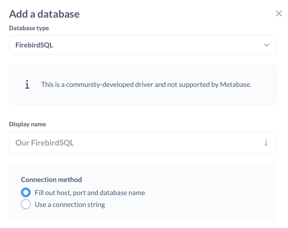

# Firebird driver for Metabase

This driver enables Metabase to connect to [FirebirdSQL](https://firebirdsql.org/) databases. Please star this repository if you
use this driver and find it useful.

## Downloads

| Driver | Firebird Version | Download |
|--------|-----------------|----------|
| **Standard** (recommended) | 2.5 – 5.0 | [Latest release](https://github.com/andrevanzuydam/metabase-firebird-driver/releases/latest) |
| **Legacy** | 1.5 – 2.5 | [v1.7.0-legacy](https://github.com/andrevanzuydam/metabase-firebird-driver/releases/tag/v1.7.0-legacy) |

> **Legacy driver:** If you need to connect to Firebird 1.5 or 2.0, use the legacy driver which bundles Jaybird 2.2.15 for wire protocol 10 support. It registers as a separate driver ("FirebirdSQL Legacy 1.5+") and can coexist with the standard driver.

## Installation

* Make sure you have installed a recent Metabase version.
* Download the [latest release](https://github.com/andrevanzuydam/metabase-firebird-driver/releases/latest) of the Firebird driver or [build it from source](#building-from-source).
* Create the `plugins` directory if it doesn't already exist. By default, that directory is next to the metabase.jar file, but you can specify a different directory by setting the environment variable `MB_PLUGINS_DIR`.
* Copy the `firebird.metabase-driver.jar` into the plugins directory. On startup, Metabase will load the plugin and the driver should be available.

## Configuration

Under Metabase Admin, click **Add database** and choose the **FirebirdSQL** driver from the list.
Choose whether you want to fill out all the connection settings or use a connection string. ***For legacy database engines you will have to use a connection string!***



The connection string is constructed like this:

```
jdbc:firebirdsql://<hostname>:<port>/<database path>?user=<username>&password=<password>&enableProtocol=<protocol>
```

## Authentication issues when using legacy Firebird (2.5 and older)

Example of connection string to connect to Firebird 2.5 (Protocol 12):

```
jdbc:firebirdsql://hostname:3050//var/lib/firebird/DATA.FDB?user=sysdba&password=masterkey&enableProtocol=12
```

Use this table below to match the version of Firebird you are trying to connect to.

| Firebird Version     | Protocol Version |
|----------------------|------------------|
| Firebird 2.1         | 11               |
| Firebird 2.5         | 12               |
| Firebird 3.0         | 15               |
| Firebird 4.0         | 16               |
| Firebird 5.0         | 19               |

> **Note:** The standard driver (Jaybird 6.x) does not support Firebird 1.0 – 2.0 (protocol 10/11). For Firebird 1.5+, use the [legacy driver](https://github.com/andrevanzuydam/metabase-firebird-driver/releases/tag/v1.7.0-legacy) instead.

If you cannot get it working, please raise an issue and be sure to include the version of Metabase & Firebird you are having the issue with.

## Compatibility

| Driver Version | Metabase Version | Firebird Version | Jaybird Version |
|---------------|------------------|------------------|-----------------|
| 1.7.0-legacy  | 0.53+            | 1.5 - 2.5       | 2.2.15          |
| 1.6.3+        | 0.53+            | 2.5 - 5.0       | 6.0.3           |
| 1.6.2         | 0.53+            | 3.0 - 5.0       | 6.0.3           |

## Building from source

### Prerequisites

* **Java 21+** (OpenJDK recommended)
* **Clojure CLI** (`brew install clojure/tools/clojure` on macOS)
* **Metabase source** checkout as a sibling directory

### Setup

Checkout the Metabase repository and the Firebird driver repository in the same parent directory:

```
workspace/
  metabase/                    # git clone https://github.com/metabase/metabase.git
  metabase-firebird-driver/    # this repository
```

Clone Metabase if you don't have it:

```bash
cd /path/to/workspace
git clone --depth 1 https://github.com/metabase/metabase.git
```

### Build

```bash
cd metabase-firebird-driver
./build.sh
```

The driver JAR will be at `target/firebird.metabase-driver.jar`.

You can also set a custom Metabase path:

```bash
METABASE_PATH=/path/to/metabase ./build.sh
```

## Local development

### Using Clojure REPL

Set up your `~/.clojure/deps.edn`:

```edn
{
  :aliases {
    :user/firebird-driver {
      :extra-deps {metabase/firebird-driver {:local/root "../metabase-firebird-driver"}}
      :jvm-opts   ["-Dmb.dev.additional.driver.manifest.paths=../metabase-firebird-driver/resources/metabase-plugin.yaml"]
    }
  }
}
```

Run a development environment:

```bash
# With nREPL
clojure -M:user/firebird-driver:nrepl --bind 0.0.0.0 --port 50605

# Or run directly
clojure -M:user/firebird-driver:run
```

### Using Docker (recommended for testing)

The `test/` directory contains a `docker-compose.yml` that sets up:
- **Metabase** on port 3001 (with the driver auto-loaded from `target/`)
- **Firebird 4.0** on port 3054
- **Firebird 2.5** on port 3055 (for legacy compatibility testing)

```bash
# Build the driver first
./build.sh

# Start the test environment
cd test
docker compose up -d

# Open Metabase at http://localhost:3001
# Connect to Firebird using:
#   Host: firebird3 (or firebird25 for legacy)
#   Port: 3050
#   Database: metabase.fdb (or metabase25.fdb)
#   User: SYSDBA
#   Password: masterkey
```

To stop:

```bash
cd test
docker compose down
```

### Running tests

Tests require a running Firebird instance. Using the Docker setup:

```bash
# Start the test Firebird database
cd test && docker compose up -d firebird3 && cd ..

# Run tests (from the metabase directory)
cd ../metabase
DRIVERS=firebird \
MB_FIREBIRD_TEST_HOST=localhost \
MB_FIREBIRD_TEST_PORT=3054 \
MB_FIREBIRD_TEST_USER=SYSDBA \
MB_FIREBIRD_TEST_PASSWORD=masterkey \
MB_FIREBIRD_TEST_DB=metabase.fdb \
clojure -X:dev:drivers:drivers-dev:test:user/firebird-driver
```

## Release notes

### Version 1.7.0-legacy
- New legacy driver for Firebird 1.5+ using Jaybird 2.2.15 (wire protocol 10 support)
- Registers as separate "FirebirdSQL (Legacy 1.5+)" driver
- Supports database sync, native SQL queries, and MBQL visual queries
- Firebird 1.5 does not have BOOLEAN type — booleans handled as 0/1 integers

### Version 1.6.3
- Fix SUBSTRING SQL generation — removes invalid comma before FROM keyword (Issue #7)
- Fix Firebird 2.5 compatibility for schema sync — uses integer 0/1 instead of BOOLEAN (Issue #3)
- Fix BOOLEAN (type 23) and BLOB SUB_TYPE 0 (binary) not being recognized during schema sync, causing "Table has no Fields" errors
- Add proper differentiation between BLOB SUB_TYPE TEXT and BLOB SUB_TYPE 0 (binary) in field type mapping
- Comprehensive test data suite with 10 tables covering all Firebird data types
- Docker-based test environment with automated setup scripts
- Improved build script with better error handling

### Version 1.6.2
- Fixes for Concat and long field names breaking queries

### Version 1.6.1
- Added ability to use a connection string
- Has fixes for group by, complex date handling

## Our Sponsors

**Sponsored with love by Code Infinity**

[](https://codeinfinity.co.za/about-open-source-policy?utm_source=github&utm_medium=website&utm_campaign=opensource_campaign&utm_id=opensource)

*Supporting open source communities - Innovate - Code - Empower*
